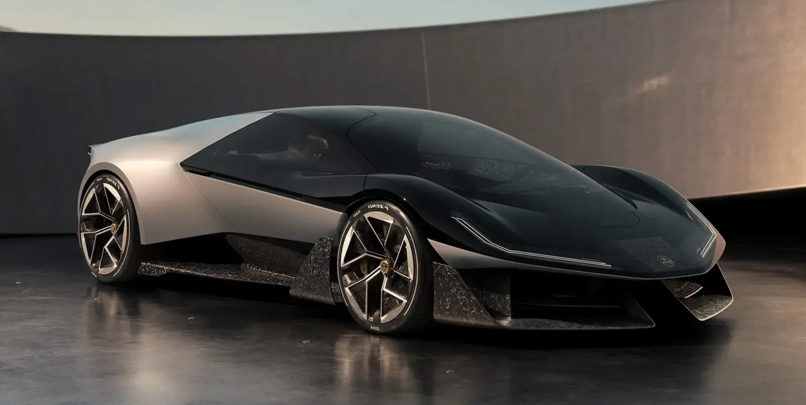

# 3D Model Reconstruction

A pipeline to convert single-view 2D images into full 3D model meshes using Monocular Depth Estimation, written in Python.

# Features

- Uses DepthAnything-v2 from HuggingFace Transformers for depth estimation from a single image.
- Conversion of depth maps to 3D point clouds using Orthographic projection.
- Estimates normals from Point Clouds using Poisson Surface Reconstruction (PSR).
- Conversion to a full 3D mesh using Open3D

## Demo

<p align="center">
  
  
</p>

<p align="center">
  
  
</p>

<p align="center">
  
  
</p>

## Tech Stack

- Python
- Depth estimation: HuggingFace transformers, DepthAnything-v2
- Open3D

## License

```
MIT License

Copyright (c) 2025 Kumar Vedant

Permission is hereby granted, free of charge, to any person obtaining a copy
of this software and associated documentation files (the "Software"), to deal
in the Software without restriction, including without limitation the rights
to use, copy, modify, merge, publish, distribute, sublicense, and/or sell
copies of the Software, and to permit persons to whom the Software is
furnished to do so, subject to the following conditions:

The above copyright notice and this permission notice shall be included in all
copies or substantial portions of the Software.

THE SOFTWARE IS PROVIDED "AS IS", WITHOUT WARRANTY OF ANY KIND, EXPRESS OR
IMPLIED, INCLUDING BUT NOT LIMITED TO THE WARRANTIES OF MERCHANTABILITY,
FITNESS FOR A PARTICULAR PURPOSE AND NONINFRINGEMENT. IN NO EVENT SHALL THE
AUTHORS OR COPYRIGHT HOLDERS BE LIABLE FOR ANY CLAIM, DAMAGES OR OTHER
LIABILITY, WHETHER IN AN ACTION OF CONTRACT, TORT OR OTHERWISE, ARISING FROM,
OUT OF OR IN CONNECTION WITH THE SOFTWARE OR THE USE OR OTHER DEALINGS IN THE
SOFTWARE.
```
